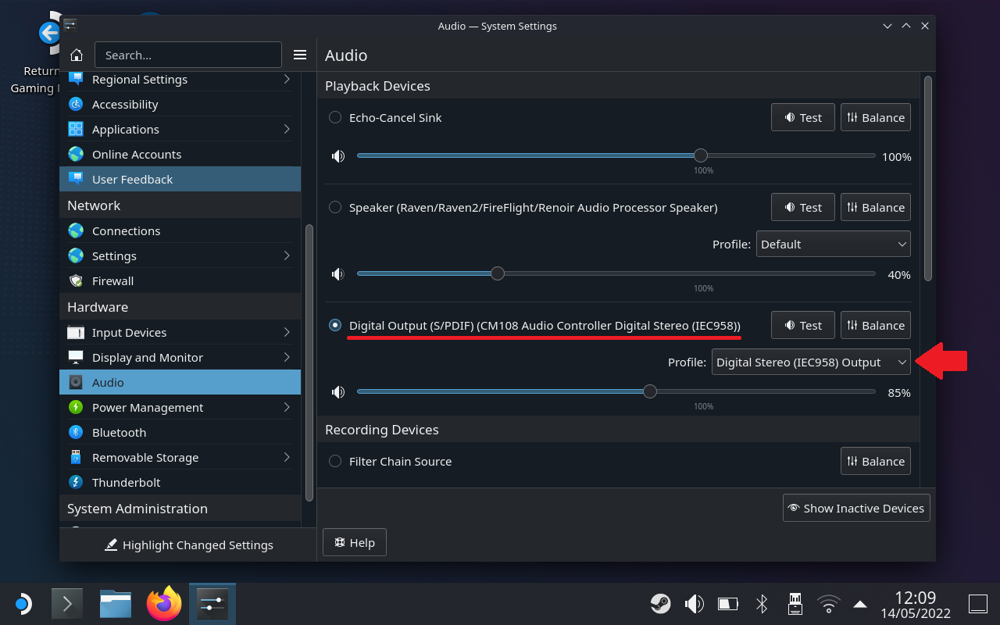

# fiberaudio-108

A low-cost USB audio interface with S/PDIF optical output, based on the Cmedia CM108AH ASIC.

<picture>
  <source media="(prefers-color-scheme: dark)" srcset="doc/block-schem-wh.svg" />
  <source media="(prefers-color-scheme: light)" srcset="doc/block-schem.svg" />
  
</picture>

View [**Schematic**](doc/sch_fiberaudio-108_rev5.pdf) :page_facing_up: or [**PCB Preview**](https://htmlpreview.github.io/?https://github.com/islandcontroller/fiberaudio-108/blob/master/doc/ibom.html) :globe_with_meridians:. Customize using the [**CM108AH Configuration Tool**](sw/README.md) :cd:.

Production files will be made available on the [Releases](https://github.com/islandcontroller/fiberaudio-108/releases) page, once validation is complete.

### Key features

* Cmedia CM108AH audio interface ASIC
* 2.0 Stereo, up to 16-bit/48kHz (CD-DA equivalent)
* USB Mini-B input
* Optical S/PDIF output (JIS F05, e.g. TOSLINK&trade;)
* USB Audio Device Class 1.0, uses generic drivers
* Configuration EEPROM

## Overview

This USB audio interface provides a low-cost S/PDIF optical output for portable computers and tablet devices. Audio tranmission via optical link - as opposed to a wired line-level connection - eliminates hum caused by ground potential differences, and noise feed-through from switched-mode power supplies.

| Design Requirement | Solution Approach |
|--------------------|-------------------|
| Provide electrical isolation between device and audio equipment | Audio signal transmission via optical link (e.g. TOSLINK&trade;) |
| Compatibility for wide range of operating systems, with minimal driver maintenance | USB Audio Device Class using OS-provided generic drivers |
| IP accessibility for PCB design files | Use of free, open-source EDA tooling (e.g. KiCad) |
| Commonly-used, small form-factor USB connector, robust enough to withstand portable use | USB **mini**-B receptacle |
| Option for manual assembly | Passives no smaller than 0603. ICs leaded and no smaller than 0.5mm pin pitch (SSOP) |
| Low PCB production capability requirements | &bullet;&nbsp;FR4 base material &bullet;&nbsp;2-layer Cu, Top+Bot Mask, Top Overlay &bullet;&nbsp;&geq;0.25mm trace-to-outline &bullet;&nbsp;&geq;0.25mm trace width and spacing &bullet;&nbsp;&geq;0.35mm drill size &bullet;&nbsp;Gerber, NC Drill and RS274X outputs |

## Design Review (Prototyping)

Prototyping was carried out using **rev. 3** board design files, in a minimum-order batch of 5 PCBs, including automated assembly.

### Assembly

* Manual rework of the PCB around `U3` (SRV05-4) was required in order to fix the issues found in *rev. 3*, after production was already started.
* Parts `U1` (AT93C46D), `U2` (CM108AH), `SW1`, and both connectors were unavailable for automated assembly, and had to be retrofitted manually using hot-air reflow soldering.

### Software Support

* Drivers included with **SteamOS 3.0** provide full functionality out-of-box, including volume controls for S/PDIF output.

* Generic Audio Device drivers included in **Windows 7.1** (x64) as well as **Windows 10** (Version 22H2, x64) only support S/PDIF output in a passthrough mode. **Volume control and the mute input are inoperative when using the default driver package** (see below for workaround).

**Workaround:** ~~A vendor-specific Windows driver package for the CM108AH is available for download from the ASIC manufacturer's website: [https://www.cmedia.com.tw/support/download_center](https://www.cmedia.com.tw/support/download_center).~~

> Updated 08/2023: *Unfortunately, the ASIC manufacturer have stopped providing any drivers for download. I uploaded the latest signed driver package I could source (Version 8.1.8.2172) as [release `v0.1.5-driver-only`](https://github.com/islandcontroller/fiberaudio-108/releases/tag/v0.1.5-driver-only). Please check the file for integrity and verify it includes the correct signed driver binary before installing.*

~~Using the Windows device manager, perform a manual driver update of the `Generic USB PnP Sound Device`, and select `Win8\SoftwareDriver` from the extracted archive as the driver installation sources directory.~~

> Updated 08/2023: *To install the driver, extract the archive and right-click install the `Cm108.INF` file.*

After installation and a reboot, a new `Digital Audio (USB PnP Sound Device)` device will show up in the Sound Settings dialog, alongside the old `Speakers (USB PnP Sound Device)` device. 

**Disable** the `Speaker` device.

This workaround was tested using Windows 7.1 (x64), and Windows 10 (Version 22H2, x64).

### Device Configuration

* A configuration tool for re-programming the external EEPROM was developed and is provided in the [`sw/`](sw/) subdirectory.

* EEPROM access sporadically seems to return invalid data. Re-reading or re-programming the affected words can be used as a workaround.

### Summary

* The device works correctly in connection with Linux systems. For Windows hosts, a custom driver installation is required for the device to operate properly.

## Licensing

If not stated otherwise within the specific file, the contents of this project are licensed under the CERN Open Hardware Licence Version 2 - Permissive. The full license text is provided in the [`LICENSE`](LICENSE) document.

        SPDX-License-Identifier: CERN-OHL-P-2.0

This licensing model is compliant with the [Open Source Hardware Definition 1.0](https://www.oshwa.org/definition/).